# Hi, I'm Oumaima 🌸

### AI & NLP Researcher · Software Engineer · MSc in Data Science

*Researching language. Engineering useful AI.*

  
  
  
  

  
  

---

## ✦ A little about my work

I explore how **language technology and machine learning** can solve meaningful real-world problems, especially when data is multilingual, noisy, or limited. My work moves between research experiments and complete software systems—from model design and evaluation to APIs and user-facing applications.

> 🌷 Currently building **[ApplyLens AI](https://github.com/oumas3/applylens-ai)**, an evidence-based assistant for understanding academic opportunities, checking eligibility, and organizing applications.

<table>
<tr>
<td width="33%" align="center">

### 🔬 Research
Low-resource NLP 
Multilingual models 
Responsible AI

</td>
<td width="33%" align="center">

### 🧠 Intelligence
Transformers 
Deep learning 
Generative models

</td>
<td width="33%" align="center">

### 💻 Engineering
FastAPI & React 
ML pipelines 
Research prototypes

</td>
</tr>
</table>

---

## 🌸 Research corner

- **Master's research:** depression-severity classification in Moroccan Darija using XLM-R and character-aware modeling for Arabizi.
- **Language & speech:** multilingual NLP, emotion-aware summarization, speaker verification, and adversarial evaluation.
- **Applied intelligence:** neuro-symbolic reasoning, explainable decision systems, and AI tools designed around real user needs.
- **Current direction:** turning research ideas into reproducible experiments and polished, usable products.

---

## ✦ Selected projects

<table>
<tr>
<td width="50%" valign="top">

### 🎓 ApplyLens AI

An evidence-based workspace that turns Master's and PhD calls into eligibility decisions, comparisons, and application checklists.

`React` `TypeScript` `FastAPI` `Python`

</td>
<td width="50%" valign="top">

### 🌿 Hybrid CVAE + DDPM

A generative and classification pipeline for plant-disease image recognition, combining representation learning with diffusion models.

`PyTorch` `CVAE` `DDPM` `Computer Vision`

</td>
</tr>
<tr>
<td width="50%" valign="top">

### 🎙️ Adversarial TD-SV

An evaluation of embedding-level adversarial attacks on text-dependent speaker-verification systems.

`PyTorch` `ECAPA--TDNN` `WavLM` `Speech AI`

</td>
<td width="50%" valign="top">

### 🧩 Hybrid Fraud Reasoning

A bank-fraud detection system combining machine learning with RDF ontologies, rule-based reasoning, and SPARQL.

`Python` `RDF` `SPARQL` `Machine Learning`

</td>
</tr>
</table>

---

## 🛠 Research & coding toolkit

**Languages**

**AI & research**

**Building & shipping**

---
📊 GitHub Activity

  

---

### Let's create together 🌷

I'm open to **research collaborations, PhD opportunities, and applied AI projects**.

A soft palette, serious research, and code built to be useful.

