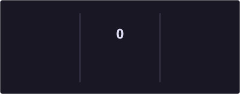

# Hi, I'm Oumaima 🌸

### AI & Software Engineer · NLP Researcher
MSc in Data Science & Analytics

*Researching language. Engineering useful AI.*

  
  
  
  

  

---

## About my work

I recently completed an **MSc in Data Science & Analytics**. I build Python applications and work on NLP experiments, especially with multilingual, noisy, or limited data. I enjoy both sides of the process: understanding how a model behaves and building the software that makes it useful.

My research interests include **Moroccan Darija, code-switched text, and model evaluation**.

> **Currently seeking a full-time junior AI, Python, or software engineering role.** I'm also interested in funded NLP/ML research positions and PhD opportunities.

I'm currently building **[ApplyLens AI](https://github.com/oumas3/applylens-ai)**, a workspace for reviewing academic opportunities against candidate evidence and organizing applications.

<table>
<tr>
<td width="33%" align="center">

### Research
Low-resource NLP 
Multilingual models 
Model evaluation

</td>
<td width="33%" align="center">

### AI & Models
Transformers 
Deep learning 
Generative models

</td>
<td width="33%" align="center">

### Engineering
Python & FastAPI 
React & TypeScript 
Document processing

</td>
</tr>
</table>

---

## Research

- **Master's research:** [Character-aware XLM-R for depression-severity text classification in Moroccan Darija](https://github.com/oumas3/darijadep-character-aware-nlp), comparing character embedding injection and gated adapters for Arabizi and code-switched text.
- **Language and speech projects:** emotion-aware summarization, speaker verification, and adversarial evaluation.
- **Other academic work:** ontology-based reasoning and interpretable decision systems.

I'm working on making my experiments easier to reproduce and documenting their methods, results, and limitations clearly.

---

## Selected projects

<table>
<tr>
<td width="50%" valign="top">

### ApplyLens AI

A workspace that helps Master's and PhD candidates review eligibility evidence, identify missing information, compare opportunities, and track application tasks.

Includes automated tests, CI configuration, and a synthetic evaluation. Default analysis uses deterministic rules and lexical retrieval; external embeddings and pgvector retrieval are optional.

`React` `TypeScript` `FastAPI` `Python`

</td>
<td width="50%" valign="top">

### CVAE + DDPM Experiments

Research notebooks exploring CVAE and diffusion-based image generation alongside plant-disease classification.

`PyTorch` `CVAE` `DDPM` `Computer Vision`

</td>
</tr>
<tr>
<td width="50%" valign="top">

### Speaker Verification & Adversarial Evaluation

Notebook-based experiments evaluating embedding-level adversarial perturbations in ECAPA-TDNN and WavLM speaker-verification systems.

`PyTorch` `ECAPA-TDNN` `WavLM`

</td>
<td width="50%" valign="top">

### Hybrid Fraud Reasoning

A collaborative academic project combining RDF/OWL ontologies, Python rules, and SPARQL in a Streamlit interface for simulated banking transactions.

`Python` `RDF/OWL` `SPARQL` `Streamlit`

</td>
</tr>
</table>

[Emotion-aware summarization](https://github.com/oumas3/emotion_imp)
·
[Siamese metric learning](https://github.com/oumas3/siamese_net_implementation)

---

## Tools I use

**Languages**

**AI & research**

**Web & application development**

**Database & development tools**

---

## GitHub Activity

  

---

### Let's connect

I'm open to **full-time junior engineering roles, funded NLP/ML research and PhD opportunities, and research collaborations**.

[LinkedIn](https://linkedin.com/in/oumaima-o-5009741b4) · [Email](mailto:ouayresbusiness@gmail.com)

